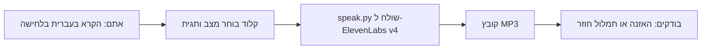

# הקראה בעברית עם מצבי דיבור, ElevenLabs v4

> תוסף ל-Claude Code שמלמד אותו להקריא עברית בטון שאתם בוחרים: לחישה, בכי, שדר ספורט, גמגום, שירה ועוד. 25 מצבי דיבור, 9 אירועי קול, וקול משלכם בהקלטה אחת.

---

## למה זה קיים

ElevenLabs v4 לא מקבל הגדרות של טון או מהירות. את הטון קובעים בתגית קטנה בסוגריים מרובעים לפני המילים, למשל `[whispers] זה סוד`. השאלה היא איזו תגית נותנת מה, ואיך לא להיתקל בכשלים שלא רואים: קובץ שנוצר תקין ונשמע לא נכון. התוסף אוסף את התגיות, נותן לכל אחת שם בעברית ומשפט לדוגמה, ומלמד את קלוד להשתמש בהן.

## איך זה עובד



## מה הסקיל עושה

🔹 **בוחר מצב דיבור.** מתוך 25 מצבים, או תגית חופשית שאתם כותבים בעצמכם.

🔹 **מקריא עם הקול שלכם.** אפשר ליצור קול מהקלטה נקייה אחת, ורק אם הוא שלכם.

🔹 **בודק לפני שמוציא קרדיטים.** מצב `--dry-run` מדפיס מה יישלח, בלי רשת ובלי עלות.

🔹 **מזהיר מפני כשלים שקטים.** מודל שגוי, טקסט ארוך מדי, ותגית שהוקראה במקום להיות מופעלת.

🔹 **שואל לפני אצווה.** כל הקראה אמיתית יורדת מהמכסה שלכם, ולכן הוא מאשר איתכם לפני יותר מכמה קטעים.

## דוגמת שימוש

**אתם כותבים:** "הקרא בעברית בלחישה: זה סוד"

**מה קורה:** קלוד בוחר את המצב `whisper`, מריץ את `speak.py` עם התגית `[whispers]` לפני הטקסט, ושומר קובץ `out.mp3`. אחרי זה הוא מציע להאזין לו.

## התקנה

### בתוך Claude Code (מומלץ)

הדביקו שתי שורות:

```
/plugin marketplace add guycoful/elevenlabs-v4-hebrew-modes
/plugin install hebrew-voice-modes@elevenlabs-v4-hebrew-modes
```

אין צורך להעתיק קבצים או לדעת איפה Claude Code יושב אצלכם.

### בלי פקודות

כתבו לקלוד: "התקן לי את הסקיל מהריפו https://github.com/guycoful/elevenlabs-v4-hebrew-modes". הוא ידע לעשות את זה בשבילכם.

## הגדרת מפתח ElevenLabs

צריך חשבון ElevenLabs ומפתח API. את המפתח לא מדביקים בצ'אט ולא שומרים בקובץ בריפו, אלא במשתנה סביבה בשם `ELEVENLABS_API_KEY`:

- מק ולינוקס: `export ELEVENLABS_API_KEY="..."` (ואם רוצים שיישאר, בקובץ ההגדרות של המעטפת שלכם)
- ווינדוס, בטרמינל: `setx ELEVENLABS_API_KEY "..."` ואז לפתוח חלון חדש

אם לא בטוחים, תכתבו לקלוד "תעזור לי להגדיר את המפתח של ElevenLabs", והוא ידריך אתכם צעד אחר צעד בלי שתדביקו אותו בצ'אט.

## להתחיל עם הקול שלכם

מקליטים כמה דקות דיבור רגיל, בחדר שקט וללא מוזיקה, ומבקשים מקלוד "צור לי קול מההקלטה הזו". מאחורי הקלעים:

```
python3 clone_my_voice.py --name "הקול שלי" --sample my_voice.mp3 --i-confirm-this-is-my-own-voice
```

הסקריפט מדפיס `voice_id`, ובו משתמשים בהקראה. הדגל הוא הצהרה שההקלטה שלכם או שיש לכם אישור כתוב מבעל הקול. יצירת קול תופסת מקום בחשבון (voice slot). הסקריפט נבדק מול שרת מדומה בלבד ולא מול ElevenLabs עצמו, ולכן אם יש שגיאה, תדווחו.

## כל המצבים

### מצבי דיבור

| מצב | בעברית | תגית | משפט לדוגמה |
|---|---|---|---|
| `commanding` | טון פוקד | `[commanding, authoritative]` | חברים, אפשר שקט ! |
| `warm_calm` | חם ורגוע | `[warm, calm]` | תודה. אני יכול להסביר לכם מה חדש. |
| `playful` | שובבי | `[playful]` | אבל זה יהיה קצת משעמם. |
| `intimate` | קרוב ואינטימי | `[intimate, close, softly]` | הקול יכול להתקרב עד שהוא מרגיש כמו סוד. |
| `whisper` | לחישה | `[whispers]` | סוד שנועד רק לכם. |
| `dry_sarcastic` | יבש ועוקצני | `[dry, sarcastic]` | ולפעמים גם למי שמשתעל בשורה השלישית. |
| `breaking` | קול נשבר | `[voice breaking]` | הוא יכול לנסות להישאר חזק... |
| `crying` | בכי | `[crying]` | הבטחתי שאחזור... אבל לא הגעתי. |
| `recovering` | מתאושש | `[taking a breath, recovering]` | ואז הוא נושם... וממשיך. |
| `explosive` | אנרגיה מתפוצצת | `[explosive energy, excited]` | או עובר מיד לשדר כדורגל ! |
| `sports` | שדר ספורט | `[sports commentator, rapid, excited]` | הוא מתקדם, עובר אחד, עובר שניים, בועט... גוווול ! |
| `breathless` | מתנשף ומשועשע | `[breathless, amused]` | טוב... נסחפנו קצת. |
| `menacing` | קול עתיק ומאיים | `[ancient, menacing, low]` | אבל לא כל קול שבוקע מהחושך רוצה שתמצאו אותו. |
| `non_human` | לא אנושי | `[non-human, eerie, whispering]` | אל תסתובבו. |
| `scream` | צרחה | `[screams]` | בו ! |
| `apologetic` | שובבי ומתנצל | `[playful, apologetic]` | סליחה. הייתי חייב. |
| `stutter` | גמגום | `[stuttering]` | אני ר... רוצה לומר משהו. |
| `stutter_frustrated` | גמגום מתסכל | `[stuttering, frustrated]` | אבל ה... המילים פשוט לא יוצאות ! |
| `amused` | רגיל ומשועשע | `[amused]` | ואפשר גם להפוך אותו לדמות מצוירת. |
| `cartoon` | דמות מצוירת | `[cartoon character voice]` | שלום ילדים ! מי רוצה לשמוע בדיחה ממש ממש גרועה ? |
| `singing` | שירה | `[singing]` | קול עולה, קול יורד, כל סיפור מיד רוקד. |
| `opera` | אופרה | `[operatic singing]` | ופתאום הכול מואר ! |
| `behind_door` | מאחורי הדלת | `[muffled, from behind a door]` | סליחה שחר, אתה צריך לסיים. |
| `reassuring` | מרגיע | `[reassuring]` | זה בסדר, אני בסוף. |
| `warm_close` | חם | `[warm]` | תודה לכולם. |

### אירועי קול

| אירוע | בעברית | תגית | משפט לדוגמה |
|---|---|---|---|
| `crowd_murmur` | המולה באולם | `[crowd murmuring]` | חברים, אפשר שקט ? |
| `whistle` | שריקה | `[whistle]` | תקשיבו רגע. |
| `cough` | שיעול | `[coughs]` | סליחה. |
| `crowd_laughs` | הקהל צוחק | `[crowd laughing]` | הייתי חייב להגיד את זה. |
| `trembling_breath` | נשימה רועדת | `[trembling breath]` | אני בסדר. |
| `crowd_cheer` | הקהל משתולל | `[crowd cheering wildly]` | גוווול ! |
| `sneeze` | עיטוש | `[sneezes]` | לבריאות. |
| `knocks` | שלוש דפיקות בדלת | `[three knocks on a door]` | סליחה, אני בא. |
| `giggle` | צחקוק | `[giggles]` | זה בסדר. |

## מה נבדק ומה לא

- נבדק: בתמלול חוזר של כעשרה קליפים, התגיות לא הוקראו כטקסט.
- לא נבדק: איכות ההגשה בעברית באוזן, ואירועי הקול (עיטוש, דפיקות, קהל). תשמעו לפני שמשתמשים בפרודקשן.
- מה שנשמע טוב בקול אחד לא בהכרח נשמע טוב באחר. `[excited]` נשמע ילדותי בחלק מהקולות.

## שימוש הוגן

- כל הקראה אמיתית עולה קרדיטים בחשבון שלכם. תוכנית חינמית עם מכסה מוגבלת קיימת, ואת המחיר והמכסה בדקו בעמוד התמחור של ElevenLabs.
- שכפול קול של אדם אחר דורש אישור שלו בכתב. התוסף לא משכפל קולות בלי הצהרה מפורשת.
- אל תפרסמו הקלטות בקולו של אדם אחר בלי אישורו.

## מבנה הריפו

```
elevenlabs-v4-hebrew-modes/
├── .claude-plugin/
│   ├── plugin.json
│   └── marketplace.json
├── skills/elevenlabs-v4-hebrew-modes/
│   ├── SKILL.md              # ההגדרה שקלוד קורא
│   ├── scripts/
│   │   ├── speak.py          # הקראה, רשימת מצבים וקולות, dry-run
│   │   └── clone_my_voice.py # יצירת קול מהקלטה שלכם
│   └── reference/modes.json  # 25 מצבים ו-9 אירועי קול
├── README.md
└── LICENSE                   # MIT
```

## English

Claude Code plugin for Hebrew text-to-speech with ElevenLabs v4 speaking modes: 25 modes and 9 sound events mapped to v4 tags, a `speak.py` script with a no-cost `--dry-run`, and a `clone_my_voice.py` script that requires an explicit confirmation that the recording is your own voice. Install with `/plugin marketplace add guycoful/elevenlabs-v4-hebrew-modes` and then `/plugin install hebrew-voice-modes@elevenlabs-v4-hebrew-modes`. You need your own ElevenLabs API key in the `ELEVENLABS_API_KEY` environment variable. Every real generation uses your credits.

## רישיון

MIT. ראו את הקובץ LICENSE.

נבנה על ידי [גיא כהן](https://github.com/guycoful).
